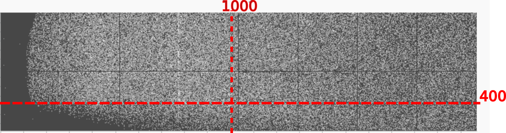

Question set 1 - minimum settings
===================================

Create the setup file
------------------------

Try creating your own experiment setup file using the details described below

**experiment 1**

The experiment was conducted in experimental hutch 1 using a horizontal setup, and the data is being saved to the following path *'/dls/science/groups/das/ExampleData/i07/fast_rsm_example_data/si40084-1/'*. After aligning the sample the beam centre was *(1455,270* and the detector distance was *0.45 meters*. You would like the mapper to calculate both Qmap and Intensity vs Q profiles, and save the output to the data directory in the subfolder *'processed_data'* . Additionally you would like to map each image individually. 

**experiment 2**

The experiment was conducted in experimental hutch 2, with data saved to the following path *'/dls/science/groups/das/ExampleData/i07/fast_rsm_example_data/si41357-1'* within the subfolder *'sample_A'*. The beam centre is show in the image below with the two red lines, and the detector distance was *89 cm*. You would like for all images to be combined into one map of the horizontal vs vertical exit angle, saved into a *'sample_A'* subfolder in *'/home/myoutputs/'*.

