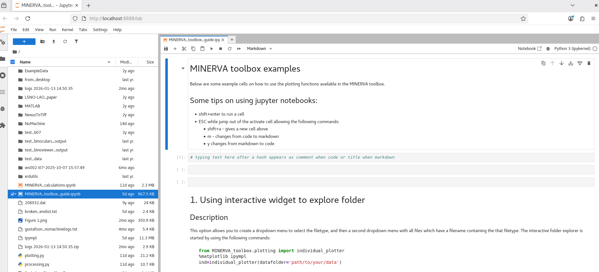

Using the Minerva toolbox notebook
===================================

The MINERVA_toolbox can be accessed from the diamond module system using the command:

.. code-block:: bash

    module load minerva_toolbox

If this is your first time running the toolbox you can make a copy of the guide notebook using the command:

.. code-block:: bash
    
    copy-notebook

This will have made a copy of the guide notebook into you Documents folder. Navigate to that folder with the command:

.. code-block:: bash

    cd ~/Documents

Then you can launch the jupyter lab viewer using the command:

.. code-block:: bash

    jupyter-lab

This will open up a new jupyter lab window in firefox, and the file 'MINERVA_toolbox_guide.ipynb' should be visible in the file navigator. 

